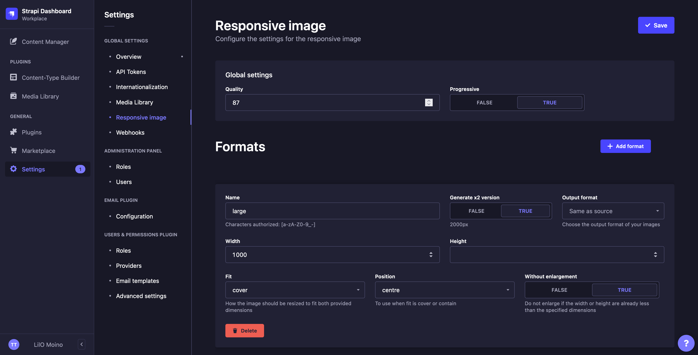

# Strapi plugin responsive-image

Custom responsive image formats for https://strapi.io

<div>
  
</div>

## How it works

- Go to the settings and choose the **Responsive image** menu
- Add/edit the formats
- Upload a new media and it will have the new formats automatically generated

## Installation

Using npm

```bash
npm install --save strapi-plugin-responsive-image
```

Using yarn

```bash
yarn add strapi-plugin-responsive-image
```

## Setup

We need to override the _image manipulation_ of the _upload_ plugin and use the one from this plugin. So we need to add a `image-manipulation.js` file within the `extensions/upload/services/` folder.

e.g

```bash
mkdir -p extensions/upload/services/
touch extensions/upload/services/image-manipulation.js
```

Paste the code below in the file.

```javascript
"use strict";
/**
 * Image manipulation functions
 */

const {
  generateResponsiveFormats,
} = require("strapi-plugin-responsive-image/extensions/upload/services/image-manipulation.js");

module.exports = {
  generateResponsiveFormats,
};
```

Now when you'll upload a file you'll have the formats of the settings page.

## Global options

The plugin uses [sharp](https://github.com/lovell/sharp) to resize the image.

| Input       | Description                      |
| ----------- | -------------------------------- |
| Quality     | Quality, integer 1-100           |
| Progressive | Use progressive (interlace) scan |

## Format options

| Input               | Description                                                                                                                                              |
| ------------------- | -------------------------------------------------------------------------------------------------------------------------------------------------------- |
| Name                | **Required** Name of the format. The file generated will look like `name_file_uploaded_hash.jpeg`                                                        |
| Generate x2 version | If ON it generates a format `name_x2` with a width and a height twice bigger                                                                             |
| Width               | **Required** Width of the image                                                                                                                          |
| Height              | Height of the image                                                                                                                                      |
| Fit                 | How the image should be resized to fit both provided dimensions. [More info](https://sharp.pixelplumbing.com/api-resize#parameters)                      |
| Position            | To use when fit is cover or contain. [More info](https://sharp.pixelplumbing.com/api-resize#parameters)                                                  |
| Without enlargement | Do not enlarge if the width or height are already less than the specified dimensions. [More info](https://sharp.pixelplumbing.com/api-resize#parameters) |

## TODO

- Better UI/UX, maybe like the settings of the webhooks
- Add re-generate button to re-generate all the formats if we change the settings
